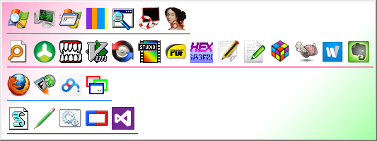
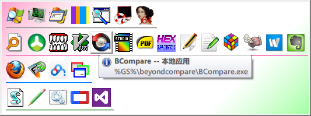
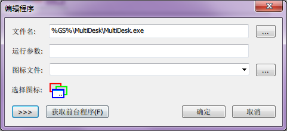
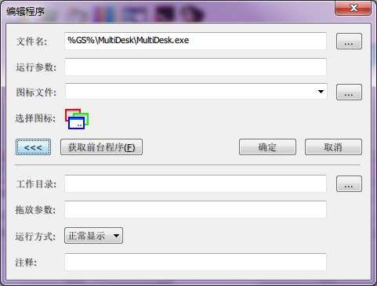

# HandyRun

当前版本2.5.4

## 程序功能

HandyRun呈现一个包含图标的界面，让你快速的启动程序。









通过按快捷键（支持双击形式，缺省是双击ctrl）或把鼠标移到屏幕边缘特定位置，就可以打开运行界面。可以在运行界面点击程序图标或输入命令(有命令提示)来运行程序，也可以把文件或文本拖放到运行界面的程序图标上打开。

## 运行方式

HandyRun是绿色软件。HandyRun有两种运行方式：一种是后台运行模式，另一种是单次运行模式。缺省的运行模式是后台运行，可以通过指定命令行参数 /once让其单次运行。

- 在后台运行模式下，程序启动后不显示图标面板，只有当热键或鼠标激活时才会弹出面板。在适当的时候面板会自动隐藏，也可以按esc或热键手动隐藏。
- 在单次运行模式下，启动后在屏幕中央弹出图标面板。当用户点击图标后、或按ESC后、或窗口失去焦点后，HandyRun退出。这种模式是为了其它程序可以很方便地调用（比如hoekey）。

## 基本概念

### 热键

HandyRun除支持普通热键外，还支持双击热键：即双击某个键激活程序。

普通热键是指一个或几个功能键加上一个普通键的组合。功能键有四个：CTRL, ALT, SHIFT, WIN。其余的键盘上键都是普通键。普通热键的表示方式与hoekey相同：功能键用单个字符表示：@表示ALT，\^表示CTRL，\_表示SHIFT，\~表示WIN；普通键以键名表示，紧接在功能键的后面。如`^@F11`表示CONTROL+ALT+F11，`_@^~R`表示CONTROL+ ALT+ SHIFT+ WIN+ R，等等。

双击热键支持所有键盘上的按键。不过最好选择ctrl, shift等单击时不会影响当前应用程序的键。双击热键的表示方式是键名前加引号，如”CONTROL表示双击CTRL，”PAUSE表示双击Pause(Break)键。
键盘的键名可以通过vkcode.txt查阅。

### 窗口停靠

HandyRun可以像QQ那样在屏幕边缘把界面隐藏，当鼠标滑过屏幕边缘的一小块感应区域时，界面就会打开。窗口停靠是通过指定配置文件里的style=edge实现的。

### 环境变量

可以在配置文件里设置一些额外的环境变量，用于组成程序路径。推荐程序路径采用环境变量+相对路径的形式（如：%greensoft%\ ftpserv.exe）。

### 图标描述格式

图标描述的语法为：图标文件|图标序号(从0开始)。图标文件可以采用以下几种形式：

- 空：表示图标文件为当前的可执行程序名。
- EXE或DLL文件名
- 已知文件类型的扩展名：比如.doc，.pdf，.txt等等
- ICO图标文件
- \：图标文件为\时，Handyrun不显示任何图标，此程序在界面上的对应区域是一片空白。

## 配置文件说明

### General段

包含一些全局配置。

`activate_key = <激活热键>`
设置程序的激活热键。激活热键的语法见热键

`path = <程序搜索路径>`
当配置文件中的程序名不完整(相对路径)时，Handyrun试图用这里设置的搜索路径搜索程序

`keep_dos_cmd_window = <运行DOS命令后是否自动保留dos窗口>`
  0 不自动保留（在运行命令时按住ALT键可以强制保留）
  1 自动保留

`executable_ext = <可执行程序扩展名>`
影响①命令提示中出现的文件类型②导入程序时搜索的文件类型

`single_instance = <是否单实例运行>`
  0 不单实例（可以同时多次运行Handyrun）
  1 单实例

### Ui段

`layout = <样式>`  group 分组样式;   plain 平坦样式;   simple 最简样式

最简样式如图:


`style = <窗口停靠风格>`
  center 窗口居中，不停靠
  edge 窗口停靠在屏幕边缘

`edge = <窗口停靠在何处>`
  可取top, left, right, bottom

`edge_pos = <停靠窗口的起始位置> （单位：像素）`
停靠窗口为有厚度的矩形。当指定窗口停靠在屏幕左(右)时，此矩形相当于在屏幕左(右)边的一段竖线段；当指定窗口停靠在屏幕上(下)时，此矩形相当于在屏幕上(下)边的一段横线段。

`edge_window_thickness = <停靠窗口的厚度>`  （单位：像素）

`edge_window_len = <停靠窗口的长（高）度>` （单位：像素）

`border = <窗口中的图标的边缘和窗口边缘的空隙>`

`icon_size = <窗口中显示的图标大小>`

`pad_h = <图标的水平间距>`

`pad_v = <图标的垂直间距>`

`icon_per_line = <在平坦样式下，每行显示的图标个数>`

`edit_height = <命令输入窗口的高度>`

`pad_icon_edit = <命令输入窗口和上面的图标之间的间距>`

`min_window_width = <界面的最小宽度>`
一般情况下，界面的宽度是根程序图标的数量有关系。比如在分组模式下，同一组内程序越多，造成界面宽度越宽。如果每一组程序都很少，界面就很窄。但界面最窄也不会小于最小宽度。

`use_tip = <是否在图标上显示工具提示>`
  1 显示
  0 不显示

`use_simple_tip = <是否使用简化的工具提示>`
  1 使用简化（单行）的提示，用于在命令提示的显示有问题时
  0 不简化

### Var段

可以在该段设置一些额外的环境变量，用于组成程序路径。
```
<变量> = <值>
<变量> = <值>
。。。。。。
```

### Index_path段

该段用于指定命令提示的索引源。HandyRun到这些目录去搜索指定类型（通常是可执行程序）的文件用于命令提示。可以包含多个索引源，每个索引源的格式如下：

`Path = <索引源路径>`
如：%userprofile%\「开始」菜单

`Depth = <搜索深度>`
例如1表示只搜索一层。用0表示不限搜索层数。缺省为0

`Icon = <图标描述>`
出现在命令提示框里的图标

### Group:xxx段

可以有多个group段，只要它们的名字互不相同即可。每个group段可以包含若干个程序。这些group和程序将被以图标的形式显示在HandyRun的界面上。

`Color = <颜色>`
格式为#RRGGBB ，需要出现在每个group的第一行

`P = <程序名>`

`C = <注释>` （缺省为空）

`Param = <程序参数>`（缺省为空）

`Wd = <起始路径>`（缺省为程序所在目录）

`Icon = <显示在界面上的图标>`（缺省为程序对应的图标）

`show_type = <显示方式>` 取值为: min – 最小化  max – 最大化 hide – 隐藏窗口

以上六项构成了一个程序的完整描述。只有程序名是必须的，其它四项可选。程序名也不一定是真正的程序，可以是word文档或者其它任何可以在资源管理器里双击打开的东西。

## 技巧/FAQ

1. 如何让某程序的图标显示为空白？
指定其图标为”\”即可
3. 如何运行dir, cd等dos的内部命令？
在运行时按住alt键
4. 如何在dos命令运行结束后保留窗口？
在运行时按住alt键或设置keep_dos_cmd_window为1
5. 如何用其它用户身份运行命令？
在运行时按住shift键
6. 点击图标运行程序前能临时指定运行参数吗？
点击图标时按住ctrl键
7. 如何执行上一次输入的命令？
在Handyrun窗口被激活后按两次回车。
8. 有方便的添加正在运行的程序到HandyRun的方法吗？
先切换要添加的程序为活动窗口，这时再激活HandyRun，右键菜单里选“插入”，在弹出的对话框中点左下角的“获取前台程序”
9. 为什么启动很慢？
有可能是你设置的索引源太庞大，而又没有限制搜索深度。

## 版本历史

### V1.0

初始版本，双击CTRL（或ALT,SHIFT）弹出面板
支持自定义程序图标
“搜索路径”功能
分组模式和普通模式两种界面样式

### V1.1

- 程序只运行一个实例
- 点击图标时按住SHIFT: 以其他用户身份运行程序
- 广泛的热键支持
- 配置文件里的程序路径支持环境变量
- 修正BUG：指定CONTROL为快捷键时只有左CONTROL有效
- 修正BUG：新建进程的初始工作目录设置不正确（影响Firefox, sunderbird…）

### V2.0

- 程序图标上的工具提示
- 支持用户输入命令，回车键执行
- 类似代码提示的命令提示功能。
根据用户配置的搜索路径、搜索深度和扩展名，找到所有满足条件的文件加入到命令提示列表。
- 类似QQ的窗口停靠支持，可以停靠在屏幕的任意一边并自动收缩
- 新的界面样式：simple  -- 只显示命令输入框，不显示程序图标
- 在分组样式下可以为分组指定颜色
- 对界面元素的精细控制(边界大小，图标间距等)
- 运行程序时按住CONTROL： 用用户的实际输入运行程序(忽略命令提示窗口)
- 运行程序时按住ALT：在运行命令行程序后保留窗口
- 窗口总在最前
- 支持unicode格式的配置文件
HandyRun现在可以读取系统默认代码页的ASCII格式配置文件、UTF8格式配置文件（需要BOM）、和UTF16-LE格式配置文件（需要BOM）。但HandyRun统一以UTF8格式保存配置文件。
- 导入某目录下的所有程序成HandyRun配置文件的格式
- 可以直接从界面添加/修改/删除程序
- 可以直接编辑配置文件(类似hoekey)
- 可以在配置文件里为HandyRun增加额外的环境变量
- 修正BUG：选择其它用户运行程序时，选择用户的对话框出现在任务栏
- 修正BUG：双击按键激活程序时，可能会使当前活动窗口关联的按键状态不正常
- 修正BUG：程序退出时有可能激活不该激活的窗口
- 取消程序只运行一个实例的功能
由人来控制单实例很容易做到；而且允许程序多个实例使其应用更加灵活。

### V2.5

- 在界面对组的添加／修改／删除
- 在不重启程序的情况下切换到其它配置文件
- 命令的键盘导航
- 程序图标的拖动(按住ctrl复制)功能，可以组内拖动，也可以跨组拖动
- 命令提示窗口支持鼠标滚轮了
- 点击运行程序同时按住ctrl: 运行程序前临时指定运行参数
- 指定程序启动方式（最大化、最小化...)
- 调整：优化了内存占用
- 调整：一些界面细节的修正
- 调整：可以设定边缘吸附窗口厚度的配置项(edge_window_thickness)
- 调整：命令提示框在非simple模式时自动隐藏。在输入命令时或按回车时自动出现。
- 调整：运行dos命令后自动保留dos窗口（运行时按alt键强制保留）由选项keep_dos_cmd_window控制打开或关闭
- 修正BUG: 插入/修改程序对话框的“导入前台程序”功能不好使
- 修正BUG: 重启动windows时handyrun不能自动保存配置
- 修正BUG：在命令输入窗口不输入字符而是直接按向上或向下箭头，程序崩溃。
- 修正BUG：插入或编辑程序后造成内存泄露
- 修正BUG：在程序编辑对话框指定的图标文件的绝对路径如果和程序路径的长度相同，且不等于程序路径，那么图标文件将无法保存
- 修正BUG：热键隐藏Handyrun后，有时不能正常回到原来的工作窗口
- 修正BUG：边缘隐藏模式时吸附窗口的显示不正常
- 修正BUG：如果程序图标索引超过9则不能被正确设置

### 版权

1. 本软件是免费软件，版权归本人所有。
2. 使用者若要以任何形式从事商业营利用途（包括收录于商业网站或光盘），必须事先取得本人同意；在非商业意图下，则允许随意散布及使用。
3. 欢迎散布作品，但请保持作品的完整性，不可将其修改，或重新打包，或以其它名义散布。
4. 您必须自行承担使用该软件所有可能引起的后果及损失，本人不提供对软件的技术支持及服务，也不对因使用本软件而造成任何形式的损失负责。
